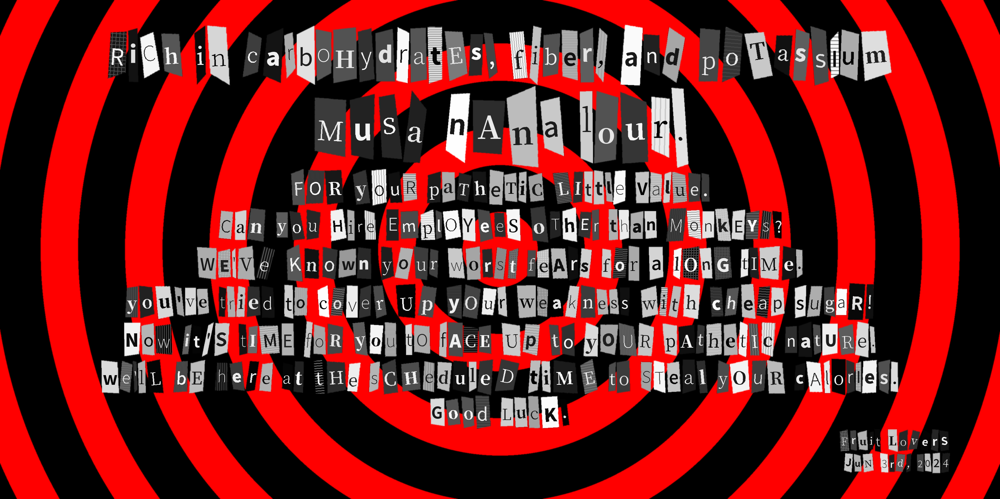

# Persona 5 Calling Card Generator

[中文](README_zh.md) | **English**

This Python script is used to generate Persona 5 style “calling card” .

## Main Features

- Generate Persona 5 style teaser letters
- Support for customizing card background, content and text styles
- Many customizable details

An example of generation is shown below:



## Requirement

To run this script, at least two libraries, NumPy and Pillow (PIL), need to be installed. These libraries are installed by default for users who configure their Python environment with Anaconda.

## Usage

For those familiar with Python and willing to read the code, it is sufficient to modify the input parameter `card = CallingCard(...)' in the `main()` function. ` input parameter in the `main()` function.

For others, an easy-to-use GUI is under development and may be presented as a web page. This may take some time due to the author's limited energy and knowledge and experience in web development.

## Parameters

### Basic parameters

- `fonts_path`: folder for fonts in `.ttf`/`.otf` format. For Windows users, the script points to the user fonts folder by default. Note:** Because (1) there are some special fonts in the system font folder; (2) you may encounter font files with incomplete font libraries during the random font selection process, which may lead to display errors, it is better to use another folder to store all the fonts you want to use**.
- `set_width`: the width of the image in pixels (px). Since the length of the content is uncertain, only the width setting is open, the length will be dynamically adjusted according to the actual content.
- `side_space`: The inner margin of the image. When 0.05 is entered, the inner margin of the image is set to 5% on each side, i.e. the actual content is 90% of the width of the image.
- `background`: An instance of the `CardBackground` class used to generate a card background with concentric circles. There are two parameters in the form of lists, both of which need to be the same length.
  - `radii`: the radius increment of the concentric circles from inside to outside.
  - `colors`: the color of the concentric circles from inside to outside. You can use hexadecimal color values (e.g. `#FFF` or `#FF0000`).
- `contents`: list of contents. The contents are a series of `Paragraph` instances. The constructor for each instance has four formal parameters.
  - `text`: text content.
  - `align`: the alignment, which must be one of `L` (left), `C` (center) or `R` (right).
  - `type`: the content type, which determines the base size of the font. Must be one of the following five values. 
    - `“salutation”`: the designation of the recipient of the message (e.g. `carbohydrate-rich`)
    - `“name”`: the name of the recipient of the message (e.g. `Mr. Banana`)
    - `“body”`: the body of the message (e.g. `We'll take your calories when we can`)
    - `“signature”`: name of the sender of the message (e.g. `Fruit Hunter`)
    - `“date”`: the date
  - `stretch`: the maximum value of the outer margin (margin), which is a list of two `floats` representing the horizontal and vertical extent to which the text in the content can be stretched. The script will sample a number of values from the range, producing exaggerated quads to be used as underlines for each word.
- `smooth`: Whether or not to perform smoothing. The image generated by PIL is sharp, if you want a smoother image you can set this value to `True`, otherwise no smoothing will be done by default.

### Advanced parameters

In addition to the above parameters, the generator has some interesting customizable parameters. However, these parameters are relatively less used and a bit more complex.

- `MODE`: Two color schemes for the text in Persona 5's teaser letter: dark text on a light background (`“light”`), or light text on a dark background (`“dark”`).
- `MODE_WEIGHT`: the appearance weight of the above color scheme, default is `[1, 1]` with equal probability. Feel free to adjust the weight to your own preference, e.g. always `[0, 1]` for dark background and light text.
- `PATTERN`: Four underlines for the text in Persona 5's teaser letter: solid color, vertical stripes, horizontal stripes, or checkered.
- ``PATTERN_WEIGHT``: The appearance weight of the above underline, default is ``[15, 2, 2, 1]``. Feel free to adjust it to your favorite weight, e.g. `[0, 0, 0, 1]` for plaid always.
- `BASESIZE`: A dictionary holding content types and their base sizes. The actual text will float within $[90\%, 110\%]\times \verb|BASESIZE|$.

## Update program

- [x] Basic program
- [x] "L" color mode in `PIL`
- [x] Image smoothing options
- [ ] More customizable details
- [ ] GUI

## License

```text
MIT License

Copyright (c) 2024 Horiz21

Permission is hereby granted, free of charge, to any person obtaining a copy
of this software and associated documentation files (the "Software"), to deal
in the Software without restriction, including without limitation the rights
to use, copy, modify, merge, publish, distribute, sublicense, and/or sell
copies of the Software, and to permit persons to whom the Software is
furnished to do so, subject to the following conditions:

The above copyright notice and this permission notice shall be included in all
copies or substantial portions of the Software.

THE SOFTWARE IS PROVIDED "AS IS", WITHOUT WARRANTY OF ANY KIND, EXPRESS OR
IMPLIED, INCLUDING BUT NOT LIMITED TO THE WARRANTIES OF MERCHANTABILITY,
FITNESS FOR A PARTICULAR PURPOSE AND NONINFRINGEMENT. IN NO EVENT SHALL THE
AUTHORS OR COPYRIGHT HOLDERS BE LIABLE FOR ANY CLAIM, DAMAGES OR OTHER
LIABILITY, WHETHER IN AN ACTION OF CONTRACT, TORT OR OTHERWISE, ARISING FROM,
OUT OF OR IN CONNECTION WITH THE SOFTWARE OR THE USE OR OTHER DEALINGS IN THE
SOFTWARE.
```
