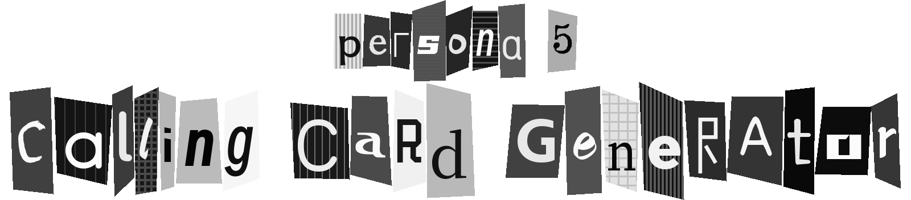
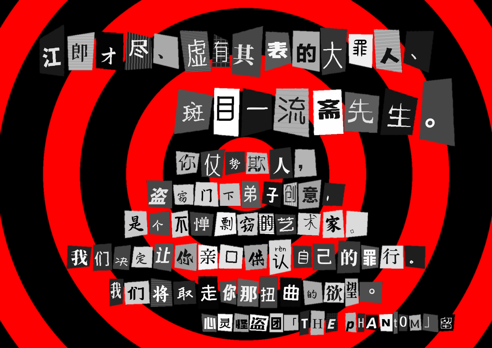

# Persona 5 Calling Card Generator

[中文](README_zh.md) | **English**



P5CCG allows you to effortlessly create calling cards with the signature look of Persona 5. In just a few minutes, you can craft personalized calling cards for your personal projects, fan works, or simply to express your love for the game.

## Main Features

- Generate Persona 5 style calling cards
- Customize details such as background, paragraph and character/letter style
- Easy-to-use GUI

An example of generation is shown below:



## How to use

### GUI

For those unfamiliar with Python, a packaged `.exe` file is available on the release page of this repository, just download it and use it. Currently, only the Windows version is available. Help is available in the lower left corner of the software interface.

**Note**: In some Windows versions, P5CCG may not recognize the default user font directory correctly, resulting in a failure. To avoid this problem, we strongly recommend that all P5CCG users create program-specific font libraries to hold candidate generated fonts. This will also prevent garbage and gaps caused by incomplete font libraries.

### Source code

For those who are familiar with Python or are willing to read the code, all you need to do is read and modify the input parameter `card = CallingCard(...)' in the `main()` function of the `demo.py` file. ` input parameter in the `main()` function of the `demo.py` file. More advanced parameters can be unlocked by using P5CCG with source code.

**NOTE**: At least Pillow (PIL) needs to be installed to run this script.

## Parameters

For interested developers and advanced feature users, this section shows more detailed instructions.

### `CallingCard`

The class that directly creates a teaser is the `CallingCard` class. The formal parameters for constructing this class are described here.

- `set_width`: The width of the image in pixels.
- `padding`: The padding of the image. Either an `int` value representing the paddings of all the sides, or an integer list of length 1/2/4 representing the paddings of the `[all]`/`[left & right, top &bottom]`/`[left, top, right, bottom]`.
- `background`: instance of `CardBackground` class. See [later](#cardbackground).
- `paragraphs`: A list of `Paragraph` instances. See [later](#paragarph).
- `fonts_path`: Fonts folder, holding font files in `.ttf`/`.otf` formats. For Windows users, the script points to the user fonts folder by default. Note that: **Because (1) there are some special fonts in the system font folder; (2) you may encounter font files with incomplete font libraries in the process of randomly selecting fonts, which may lead to display errors, it is better to use another folder to store all the fonts you want to use**.
- `smooth`: whether to smooth. The image generated by PIL is sharp, if you want a smoother image, set this value to `True`, otherwise no smoothing will be done.

### `CardBackground`

Instances of the `CardBackground` class are used to generate card backgrounds with concentric circles. There are two parameters in the form of lists, which **need to be the same length**.

- `radii`: the radius increment of the concentric circles from inside to outside.
- `colors`: the color of the concentric circles from inside to outside. Can use hexadecimal color values (e.g. `"#FFF"` or `"#FF0000"`).

A constant `PERSONA5_BACKGROUND` is provided in `default_styles.py`, which is the default style for red and black.

### `Paragarph`

The constructor of each `Paragarph` instance has two formal parameters.

- `text`: the content of the text.
- `style`: an instance of the `ParagarphStyle` class, specifying the style of the paragraph.

The `ParagarphStyle` class is a style for the `Paragraph` class, and each `Paragraph` class has a separate style. The style's constructor needs to be passed in:

- `align`: alignment, must be one of `"L"` or "`Left"`, `"C"` or `"Center"` or `"Centre"`, `"R"` or `"Right"`, case insensitive.
- `float`: vertical offset of single character, `int` in pixels. The generator will center the image of all current words vertically, then vertically offset each word by a random value in `[-float, float]`.
- `shift`: horizontal offset between character in pixels. Either an `int` value, representing the horizontal character spacing fixed to the `shift` value, or an integer list of length 2, representing the word spacing randomly sampled within the `shift` range, respectively. In the case of a list, the right value should be no less than the left value.
- `character_style`: The style of the text in the paragraph. See [later](#character).

The `default_styles.py` file sets some default styles, such as `TITLE_PARAGRAPH` and `CONTENT_PARAGRAPH`.

### `Character`

The `Character` class is not normally called manually. Its constructor needs to be passed in:

- `character`: A single character to be rendered, or you could say it's a letter.
- `style`: `CharacterStyle` object, rendering style.
- `pattern`: `Pattern`, the background pattern for the individual characters.

Required to be passed in the constructor of the important `CharacterStyle` class:

- `basesize`: The font base size of the content. The actual text size is the value multiplied by a factor that follows a normal distribution $N(1,0.1)$ and is restricted to be in the range $[75\%, 125\%]$.
- `rotate_sigma`: standard deviation of font rotation. The actual text will be rotated obeying a normal distribution of $N(0,\verb|rotate_sigma|)$ in degrees.
- `stretch`: the maximum value of the margin, which is a list containing two `floats` representing the horizontal and vertical stretch to which the character pattern in the content can be stretched. The script will sample a number of values from the range, producing exaggerated quadrilaterals as the shape of each character's underline.
- `swapcase_rate`: the probability of converting the case of the original letters, should be a number between $[0,1]$. Only works for ASCII Latin letters.

`Pattern` is not configurable at this time. However, it can be adjusted by modifying the following global parameters.

- `SCHEME`: Two color schemes for text: light background with dark text (`"light"`), or dark background with light text (`"dark"`).
- `SCHEME_WEIGHT`: the appearance weight of the above color scheme, default is `[1, 1]` with equal probability. Feel free to adjust the weight to your own preference, e.g. `[0, 1]` for always dark background and light text.
- `PATTERN`: Four underline patterns for text: `"flat"` color, `"vertical"` stripes, `"horizontal"` stripes, or `"grid"`.
- `PATTERN_WEIGHT`: the weight of the above text, default is `[15, 2, 2, 1]`. Feel free to adjust it to your favorite weight, e.g. `[0, 0, 0, 1]` for always `"flat"`.

## Update plan

- [x] Basic program
- [x] "L" color mode in `PIL`
- [x] Image smoothing options\
- [x] Demo
- [x] More customizable details
- [x] GUI
- [ ] More beautiful GUI

## License

```text
MIT License

Copyright (c) 2024 Horiz21

Permission is hereby granted, free of charge, to any person obtaining a copy
of this software and associated documentation files (the "Software"), to deal
in the Software without restriction, including without limitation the rights
to use, copy, modify, merge, publish, distribute, sublicense, and/or sell
copies of the Software, and to permit persons to whom the Software is
furnished to do so, subject to the following conditions:

The above copyright notice and this permission notice shall be included in all
copies or substantial portions of the Software.

THE SOFTWARE IS PROVIDED "AS IS", WITHOUT WARRANTY OF ANY KIND, EXPRESS OR
IMPLIED, INCLUDING BUT NOT LIMITED TO THE WARRANTIES OF MERCHANTABILITY,
FITNESS FOR A PARTICULAR PURPOSE AND NONINFRINGEMENT. IN NO EVENT SHALL THE
AUTHORS OR COPYRIGHT HOLDERS BE LIABLE FOR ANY CLAIM, DAMAGES OR OTHER
LIABILITY, WHETHER IN AN ACTION OF CONTRACT, TORT OR OTHERWISE, ARISING FROM,
OUT OF OR IN CONNECTION WITH THE SOFTWARE OR THE USE OR OTHER DEALINGS IN THE
SOFTWARE.
```
